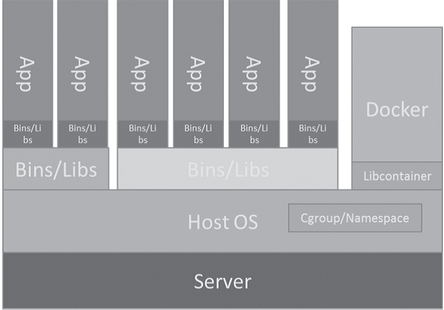

# Docker容器技术学习总结 #
## 2.Docker简介 ##
### 2.1 Docker基本概念 ###
#### 2.1.1 Docker是什么？ ####
Docker定义：一个开源的**容器引擎**，可以方便地对容器进行管理。  
Docker优势：其对镜像的打包封装，以及引入的Docker Registry 对镜像的统一管理，构建了方便快捷的“ Build, Ship and Run”流程，它可以统一整个开发、测试和部署的环境和流程，极大地减少运维成本。另外，得益于容器技术带来的轻量级虚拟
化，以及Docker 在分层镜像应用上的创新，Docker 在磁盘占用、性能和效率方面相较于传统的虚拟化都有非常明显的提高。

#### 2.1.2 Docker架构介绍 ####
  
图2-1　Docker 架构图

从图2-1 可知，Docker 并没有传统虚拟化中的Hypervisor 层。因为Docker 是基于容器技术的轻量级虚拟化，相对于传统的虚拟化技术，省去了Hypervisor 层的开销，而且其虚拟化技术是基于内核的Cgroup 和Namespace 技术，处理逻辑与内核深度融合，所以在很多方面，它的性能与物理机非常接近。  

在通信上，Docker 并不会直接与内核交互，它是通过一个更底层的工具Libcontainer与内核交互的。Libcontainer 是真正意义上的容器引擎，它通过clone 系统调用直接创建容器，通过pivot_root 系统调用进入容器，且通过直接操作cgroupfs 文件实现对资源的管控，而Docker 本身则侧重于处理更上层的业务。

Docker 的另一个优势是对层级镜像的创新应用，即不同的容器可以共享底层的只读镜像，通过写入自己特有的内容后添加新的镜像层，新增的镜像层和下层的镜像一起又可以作为基础镜像被更上层的镜像使用。这种特性可以极大地提高磁盘利用率，所以当你的系统上有10 个大小为1GB 的镜像时，它们总共占用的空间大小可能只有5GB，甚至更少。另外，Docker 对Union mount 的应用还体现在多个容器使用同一个基础镜像时，可极大地减少内存占用等方面，因为不同的容器访问同一个文件时，只会占用一份内存。当然这需要使用支持Union mount 的文件系统作为存储的Graph Driver，比如AUFS 和Overlay。

#### 2.2 Docker的功能和组件 ####
Docker 为了实现其所描述的酷炫功能，引入了以下核心概念：

- Docker 客户端
- Docker daemon
- Docker 容器
- Docker 镜像
- Registry  

下面就分别来简单地介绍一下。

#### 2.2.1 Docker 客户端 ####
Docker 是一个典型的C/S 架构的应用程序，但在发布上，Docker 将客户端和服务器端统一在同一个二进制文件中，不过，这只是对于Linux 系统而言的，在其他平台如Mac 上，Docker 只提供了客户端。  
Docker 客户端一般通过Docker command 来发起请求，另外，也可以通过Docker 提供的一整套RESTful API 来发起请求，这种方式更多地被应用在应用程序的代码中。

#### 2.2.2 Docker deamon ####
Docker daemon 也可以被理解成Docker Server，另外，人们也常常用Docker Engine 来直接描述它，因为这实际上就是驱动整个Docker 功能的核心引擎。  
简单地说，Docker daemon 实现的功能就是接收客户端发来的请求，并实现请求所要求的功能，同时针对请求返回相应的结果。在功能的实现上，因为涉及了容器、镜像、存储等多方面的内容，daemon 内部的机制会复杂很多，涉及了多个模块的实现和交互。

#### 2.2.3 Docker 容器 ####
在Docker 的功能和概念中，容器是一个核心内容，相对于传统虚拟化，它作为一项基础技术在性能上给Docker 带来了极大优势。  
在功能上，Docker 通过Libcontainer 实现对容器生命周期的管理、信息的设置和查询，以及监控和通信等功能。而容器也是对镜像的完美诠释，容器以镜像为基础，同时又为镜像提供了一个标准的和隔离的执行环境。  
在概念上，容器则很好地诠释了Docker 集装箱的理念，集装箱可以存放任何货物，可以通过邮轮将货物运输到世界各地。运输集装箱的邮轮和装载卸载集装箱的码头都不用关心集装箱里的货物，这是一种标准的集装和运输方式。类似的，Docker 的容器就是“软件界的集装箱”，它可以安装任意的软件和库文件，做任意的运行环境配置。开发及运维人员在转移和部署应用的时候，不用关心容器里装了什么软件，也不用了解它们是如何配置的。而管理容器的Docker 引擎同样不关心容器里的内容，它只要像码头工人一样让这个容器运行起来就可以了，就像所有其他容器那样。  
容器不是一个新的概念，但是Docker 在对容器进行封装后，与集装箱的概念对应起来了，它之所以被称为“软件界的创新和革命”，是因为它会改变软件的开发、部署形态，降低成本，提高效率。Docker 真正把容器推广到了全世界。

#### 2.2.4 Docker 镜像 ####
与容器相对应，如果说容器提供了一个完整的、隔离的运行环境，那么镜像则是这个运行环境的静态体现，是一个还没有运行起来的“运行环境”。  
相对于传统虚拟化中的ISO 镜像，Docker 镜像要轻量化很多，它只是一个可定制的rootfs。Docker 镜像的另一个创新是它是层级的并且是可复用的，这在实际应用场景中极为有用，多数基于相同发行版的镜像，在大多数文件的内容上都是一样的，基于此，当然会希望可以复用它们，而Docker 做到了。在此类应用场景中，利用Unionfs 的特性，Docker
会极大地减少磁盘和内存的开销。  
Docker 镜像通常是通过Dockerfile 来创建的，Dockerfile 提供了镜像内容的定制，同时也体现了层级关系的建立。另外Docker 镜像也可以通过使用docker commit 这样的命令来手动将修改后的内容生成镜像。

#### 2.2.5 Registry ####
在前面提到的镜像中，曾指出Docker 通过容器集装箱可以很方便地转运软件，其实，Registry 也在其中扮演了重要的角色。    
Registry 是一个存放镜像的仓库，它通常被部署在互联网服务器或者云端。通常，集装箱是需要通过邮轮经行海洋运输到世界各地的，而互联网时代的传输则要方便很多，在镜像的传输过程中，Registry 就是这个传输的重要中转站。假如我们在公司将一个软件的运行环境制作成镜像，并上传到Registry 中，这时就可以很方便地在家里的笔记本上，或者在客户的生产环境上直接从Registry 上下载并运行了。当然，对Registry 的操作也是与Docker 完美融合的，用户甚至不需要知道Registry 的存在，只需要通过简单的Docker 命令就可以实现上面的操作。  
Docker 公司提供的官方Registry 叫Docker Hub，这上面提供了大多数常用软件和发行版的官方镜像，还有无数个人用户提供的个人镜像。其实，Registry 本身也是一个单独的开源项目，任何人都可以下载后自己部署一个Registry。因为免费的Docker Hub 功能相对简单，所以多数企业会选择自己部署Docker Registry 后二次开发，或者购买功能更强大的企业版Docker Hub。

### 2.3 Docker 在LXC 基础上做了什么工作 ###
Docker 在内核容器技术（Cgroup 和Namespace）的基础上，提供了一个更高层的控制工具，该工具包含以下特性。

- 跨主机部署。Docker 定义了镜像格式，该格式会将应用程序和其所依赖的文件打包到同一个镜像文件中，从而使其在转移到任何运行Docker 的机器中时都可以运行，并能够保证在任何机器中该应用程序执行的环境都是一样的。LXC 实现了“进程沙盒”，这一重要特性是跨主机部署的前提条件，但是只有这一点远远不够，比如，在一个特定的LXC 配置下执行应用程序，将该应用程序打包并拷贝到另一个LXC 环境下，程序很有可能无法正常执行，因为该程序的执行依赖于该机器的特定配置，包括网络、存储、发行版等。而Docker 则将上述相关配置进行抽象并与应用程序一同打包，所以可以保证在不同硬件、不同配置的机器上Docker 容器中运行的程序和其所依赖的环境及配置是一致的。
- 以应用为中心。Docker 为简化应用程序的部署过程做了很多优化，这一目的在Docker 的API、用户接口、设计哲学和用户文档中都有体现，其Dockerfile 机制大大简化和规范了应用的部署方法。
- 自动构建。Docker 提供了一套能够从源码自动构建镜像的工具。该工具可以灵活地使用make、maven、chef、puppet、salt、debian 包、RPM 和源码包等形式，将应用程序的依赖、构建工具和安装包进行打包处理，而且当前机器的配置不会影响镜像的构建过程。
- 版本管理。Docker 提供了类似于 Git 的版本管理功能，支持追踪镜像版本、检验版本更新、提交新的版本改动和回退版本等功能。镜像的版本信息中包括制作方式和制作者信息，因此可以从生产环境中回溯到上游开发人员。Docker 同样实现了镜像的增量上传下载功能，用户可以通过获取新旧版本之间新增的镜像层来更新镜像版本，而不必下载完整镜像，类似Git 中的pull 命令。
- 组件重用。任何容器都可以用作生成另一个组件的基础镜像。这一过程可以手动执行，也可以写入自动化构建的脚本。例如，可以创建一个包含Python 开发环境的镜像，并将其作为基础镜像部署其他使用Python 环境进行开发的应用程序。
- 共享。Docker 用户可以访问公共的镜像 Registry，并向其中上传有用的镜像。Registry 中同样包含由Docker 公司维护的一些官方标准镜像。Docker Registry 本身也是开源的，所以任何人都可以部署自己的Registry 来存储并共享私有镜像。
- 工具生态链。Docker 定义了一系列 API 来定制容器的创建和部署过程并实现自动化。有很多工具能够与Docker 集成并扩展Docker 的能力， 包括类PaaS 部署工具（Dokku、Deis 和Flynn）、多节点编排工具（Maestro、Salt、Mesos、OpenStack
nova）、管理面板（Docker-ui、OpenStack Horizon、Shipyard）、配置管理工具（Chef、Puppet）、持续集成工具（Jenkins、Strider、Travis）等。Docker 正在建立以容器为基础的工具集标准。

### 2.4 Docker 容器和虚拟机之间有什么不同 ###
容器与虚拟机是互补的。虚拟机是用来进行硬件资源划分的完美解决方案，它利用了硬件虚拟化技术，例如VT-x、AMD-V 或者privilege level（权限等级）会同时通过一个hypervisor 层来实现对资源的彻底隔离；而容器则是操作系统级别的虚拟化，利用的是内核的Cgroup 和Namespace 特性，此功能完全通过软件来实现，仅仅是进程本身就可以与其他
进程隔离开，不需要任何辅助。  
Docker 容器与主机共享操作系统内核，不同的容器之间可以共享部分系统资源，因此容器更加轻量级，消耗的资源也更少。而虚拟机会独占分配给自己的资源，几乎不存在资源共享，各个虚拟机实例之间近乎完全隔离，因此虚拟机更加重量级，也会消耗更多的资源。我们可以很轻松地在一台普通的Linux 机器上运行100 个或者更多的Docker 容器，而且不会占用太多系统资源（如果容器中没有执行运算任务或I/O 操作）；而在单台机器上不可能创建100 台虚拟机，因为每一个虚拟机实例都会占用一个完整的操作系统所需要的所有资源。另外，Docker 容器启动很快，通常是秒级甚至是毫秒级启动。而虚拟机的启动虽
然会快于物理机器，但是启动时间也是在数秒至数十秒的量级。  
**因此，可以根据需求的不同选择相应的隔离方式。如果需要资源完全隔离并且不考虑资源消耗，可以选择使用虚拟机；而若是想隔离进程并且需要运行大量进程实例，则应该选择Docker 容器。**