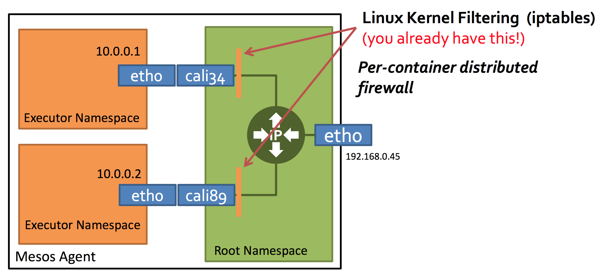

# Docker容器技术学习总结 #
## 6.Docker网络进阶##

**Docker多主机网络配置可参考：**
[http://xelatex.github.io/categories/Docker-Multi-host-Network/](http://xelatex.github.io/categories/Docker-Multi-host-Network/)

### 6.1 Docker现有多主机网络方案###

随着容器的火热发展，数人云越来越多的客户对容器网络特性要求也开始越来越高，比如：

- 一容器一IP；
- 多主机容器互联；
- 网络隔离；
- ACL；
- 对接SDN等等。

下面主要介绍Docker现有的的网络方案及其分类。

#### 6.1.1 基于实现方式分类 ####

**1．默认网络方案**  
      　NAT/BR/HOST：NAT 有性能损失，BR 有网络闪断，HOST 流控不好做，端口冲突靠业务保证没法做到透明。

**2. 隧道方案**  

通过隧道，或者说Overlay Networking的方式：

- **Weave:** UDP广播，本机建立新的BR，通过PCAP互通。
- **Open vSwitch（OVS）:** 基于VxLAN和GRE协议，但是性能方面损失比较严重，类似的方案还有 Kubernetes/Socketplane 的实现。
- **Flannel:** UDP广播，VxLan。

隧道方案在IaaS层的网络中应用也比较多，随着节点规模的增长复杂度会提升。隧道方案非常灵活，但是因为太过于灵活，出了网络问题（A-B 链路抖动）跟踪起来比较麻烦，大规模集群情况下这是需要考虑的一个点，毕竟即便是内网也不一定风平浪静。

**3. 路由方案**  
还有另外一类方式是通过路由来实现，比较典型的代表有：

- **Pipework:**对于 Docker BR 本身的扩展，当然也支持 OVS macvlan 等方案的结合。现在 libnetwork 出来变相的是废了这个项目了，长远来看后继无人，因此它不是一个很好的选择。
- **Calico:**基于BGP协议的路由方案，支持很细致的ACL控制，对混合云亲和度比较高。对于隔离要求比较严格的场景比较适合，对混合云亲和度比较高，因为它不涉及到二层的支持。
- **Macvlan:**从逻辑和Kernel层来看隔离性和性能最优的方案，基于二层隔离，所以需要二层路由器支持，大多数云服务商不支持，所以混合云上比较难以实现。

路由方案没那么灵活，大多数情况下需要有一个 agent 在容器主机上去操作，一般是从3层或者2层实现隔离和跨主机容器互通的，出了问题也很容易排查。但是路由方案对本身物理网络依赖会比隧道方案要重。另外 hook 的话毕竟还是不太优美，所以得看看 libnetwork 是怎样和 Docker 结合的。

目前我们选取的是 macvlan 的方案实现的二层隔离，说轻点主要是对容器而言，可以完全当容器为一台虚拟机。说重点，是因为其对物理网络基础设施依赖程度最高。

#### 6.1.2 基于网络模型分类 ####

Docker 1.9以后再讨论容器网络方案，不仅要看实现方式，而且还要看网络模型的“站队”。现有的网络模型有Docker原生的 “CNM”，以及CoreOS，谷歌主推的“CNI”。

**1. Docker Libnetwork Container Network Model（CNM）阵营**

- Docker Swarm overlay
- Macvlan & IP network drivers
- Calico
- Contiv（from Cisco）

Docker Libnetwork的优势就是原生，而且和Docker容器生命周期结合紧密；缺点也可以理解为是原生，被Docker“绑架”。

**2. Container Network Interface（CNI）阵营**

- Kubernetes
- Weave
- Macvlan
- Flannel
- Calico
- Contiv
- Mesos CNI

CNI的优势是兼容其他容器技术（e.g. rkt）及上层编排系统（Kuberneres & Mesos)，而且社区活跃势头迅猛，Kubernetes加上CoreOS主推；缺点是非Docker原生。

从上可以看出，第三方的网络方案是“脚踏两只船”的。如Calico，Contiv等，同时支持CNM和CNI模型。

### 6.2 Docker多主机网络方案初探 ###

#### 6.2.1 PipeWork ####

ipework是由Docker的工程师Jérôme Petazzoni开发的一个Docker网络配置工具，由200多行shell实现，方便易用。pipework通过封装Linux上的ip、brctl等命令，简化了在复杂场景下对容器连接的操作命令，为我们配置复杂的网络拓扑提供了一个强有力的工具。可以认为pipework解决的是宿主机上的设置容器的虚拟网卡、网桥、ip等，可以配合其他网络使用。

下面用三个场景来演示pipework的使用和工作原理。

**1. 将Docker容器配置到本地网络环境中**

为了使本地网络中的机器和Docker容器更方便的通信，我们常将Docker容器配置到和主机同一网段。我们只要将Docker容器和主机的网卡桥接起来，再给Docker容器配上IP就可以了。

操作代码：

	#安装pipework
	git clone https://github.com/jpetazzo/pipework
	cp ~/pipework/pipework /usr/local/bin/
	#启动Docker容器。
	docker run -itd --name test1 ubuntu /bin/bash
	#配置容器网络，并连到网桥br0上。网关在IP地址后面加@指定。
	#若主机环境中存在dhcp服务器，也可以通过dhcp的方式获取IP
	#pipework br0 test1 dhcp
	pipework br0 test1 10.10.101.150/24@10.10.101.254
	#将主机eth0桥接到br0上，并把eth0的IP配置在br0上。这里由于是远程操作，中间网络会断掉，所以放在一条命令中执行。
	ip addr add 10.10.101.105/24 dev br0; \
  
完成上述步骤后，我们发现Docker容器已经可以使用新的IP和主机网络里的机器相互通信了。

**2. 单主机Docker容器VLAN划分**

pipework不仅可以使用Linux bridge连接Docker容器，还可以与OpenVswitch结合，实现Docker容器的VLAN划分。下面，就来简单演示一下，在单机环境下，如何实现Docker容器间的二层隔离。

为了演示隔离效果，我们将4个容器放在了同一个IP网段中。但实际他们是二层隔离的两个网络，有不同的广播域。

	#在主机A上创建4个Docker容器，test1、test2、test3、test4
	docker run -itd --name test1 ubuntu /bin/bash
	docker run -itd --name test2 ubuntu /bin/bash
	docker run -itd --name test3 ubuntu /bin/bash
	docker run -itd --name test4 ubuntu /bin/bash
	#将test1，test2划分到一个vlan中，vlan在mac地址后加@指定，此处mac地址省略。
	pipework ovs0 test1 192.168.0.1/24 @100
	pipework ovs0 test2 192.168.0.2/24 @100
	#将test3，test4划分到另一个vlan中
	pipework ovs0 test3 192.168.0.3/24 @200
	pipework ovs0 test4 192.168.0.4/24 @200
完成上述操作后，使用docker attach连到容器中，然后用ping命令测试连通性，发现test1和test2可以相互通信，但与test3和test4隔离。这样，一个简单的VLAN隔离容器网络就已经完成。

由于OpenVswitch本身支持VLAN功能，所以这里pipework所做的工作和之前介绍的基本一样，只不过将Linux bridge替换成了OpenVswitch，在将veth pair的一端加入ovs0网桥时，指定了tag。底层操作如下：

	ovs-vsctl add-port ovs0 veth* tag=100
**3. 多主机Docker容器的VLAN划分**

实验环境如下，主机A和B各有一块网卡eth0，IP地址分别为10.10.101.105/24、10.10.101.106/24。在主机A上创建两个容器test1、test2，分别在VLAN 100和VLAN 200上。在主机B上创建test3、test4，分别在VLAN 100和VLAN 200 上。最终，test1可以和test3通信，test2可以和test4通信。

	#在主机A上
	#创建Docker容器
	docker run -itd --name test1 ubuntu /bin/bash
	docker run -itd --name test2 ubuntu /bin/bash
	#划分VLAN
	pipework ovs0 test1 192.168.0.1/24 @100
	pipework ovs0 test2 192.168.0.2/24 @200
	#将eth0桥接到ovs0上
	ip addr add 10.10.101.105/24 dev ovs0; 
    
	#在主机B上
	#创建Docker容器
	docker run -itd --name test3 ubuntu /bin/bash
	docker run -itd --name test4 ubuntu /bin/bash
	#划分VLAN
	pipework ovs0 test1 192.168.0.3/24 @100
	pipework ovs0 test2 192.168.0.4/24 @200
	#将eth0桥接到ovs0上
	ip addr add 10.10.101.106/24 dev ovs0; 
完成上面的步骤后，主机A上的test1和主机B上的test3容器就划分到了一个VLAN中，并且与主机A上的test2和主机B上的test4隔离（主机eth0网卡需要设置为混杂模式，连接主机的交换机端口应设置为trunk模式，即允许VLAN 100和VLAN 200的包通过）。拓扑图如下所示（省去了Docker默认的eth0网卡和主机上的docker0网桥）：

除此之外，pipework还支持使用macvlan设备、设置网卡MAC地址等功能。不过，**pipework有一个缺陷，就是配置的容器在关掉重启后，之前的设置会丢失。**

#### 6.2.2 Weave ####

**1. Weave原理**  
Weave是由Zett.io公司开发的，它能够创建一个虚拟网络，用于连接部署在多台主机上的Docker容器。Weave的原理如下：

Weave creates a network bridge on the host. Each container is connected to that bridge via a veth pair, the container side of which is given the IP address & netmask supplied in ‘weave run’. Also connected to the bridge is the weave router container.  

A weave router captures Ethernet packets from its bridge-connected interface in promiscuous mode, using ‘pcap’. This typically excludes traffic between local containers, and between the host and local containers, all of which is routed straight over the bridge by the kernel. Captured packets are forwarded over UDP to weave router peers running on other hosts. On receipt of such a packet, a router injects the packet on its bridge interface using ‘pcap’ and/or forwards the packet to peers.  

Weave routers learn which peer host a particular MAC address resides on. They combine this knowledge with topology information in order to make routing decisions and thus avoid forwarding every packet to every peer. The topology information captures which peers are connected to which other peers; weave can route packets in partially connected networks with changing topology.  

Weave routers establish TCP connections to each other, over which they perform a protocol handshake and subsequently exchange topology information. These connections are encrypted if so configured. Peers also establish UDP “connections”, possibly encrypted, for the aforementioned packet forwarding. These “connections” are duplex and can traverse firewalls.  
 

图6-1 Weave网络框架结构

Weave的框架如图6-1所示，它包含两大主要组件：

- Weave:用户态的shell脚本，用于安装Weave,将Container连接到Weave虚拟网络，并为它们分配IP。
- Weaver:运行于Container内，每个Weave网络内的主机都要运行，是一个Go语言实现的虚拟网络路由器。不同主机之间的网络通信依赖于Weaver路由。

**2. Weave使用实例：**
	
	#主机1：
	$ weave launch #启动weave
	#weave run命令会调用docker run -d（同理，weave start会调用docker start）以及下面的IP地址和网络的形式(CIDR)
	$ weave run 10.2.1.1/24 -it ubuntu bash 

	主机2：
	$ weave launch
	$ weave run 10.2.1.2/24 -it ubuntu bash

Weave分配不同网段之间的容器ping不通。

**3.Weave优缺点**

Weave的优点：  
Weave的功能强大，安全方面支持host之间通信加密（`weave launch[-password][-nickname]`），满足跨主机多子网功能需求且服务质量较为稳定，支持container动态加入或剥离网络。

Weave的缺点：   
由于Weave没有使用诸如Consul或Etcd等服务发现机制，因此也存在较大的缺点：

- 不支持服务发现，主机不能动态加入节点网络，只能手动通过`weave launch`或`connect`加入Weave网络
- 不支持动态分配IP。所有IP需要手动管理及分配，难以保证分配的IP不冲突。

Weave推出了Weave Plugin可以对接Libnetwork remote driver，与Docker可以更好的整合，体验更好。 

#### 6.2.3 Flannel ####
[http://dockone.io/article/618](http://dockone.io/article/618)

**1. Flannel简介**  
Flannel是 CoreOS 团队针对 Kubernetes 设计的一个覆盖网络（Overlay Network）工具，其目的在于帮助每一个使用 Kuberentes 的 CoreOS 主机拥有一个完整的子网。Flannel为Kubernetes提供网络规划服务，简单来说，它的功能是让集群中的不同节点主机创建的Docker容器都具有全集群唯一的虚拟IP地址。

在Kubernetes的网络模型中，假设了每个物理节点应该具备一段“属于同一个内网IP段内”的“专用的子网IP”。例如：

	节点A：10.0.1.0/24
	节点B：10.0.2.0/24
	节点C：10.0.3.0/24

但在默认的Docker配置中，每个节点上的Docker服务会分别负责所在节点容器的IP分配。这样导致的一个问题是，不同节点上容器可能获得相同的内网IP地址。并使这些容器之间能够之间通过IP地址相互找到，也就是相互ping通。

Flannel的设计目的就是为集群中的所有节点重新规划IP地址的使用规则，从而使得不同节点上的容器能够获得“同属一个内网”且”不重复的”IP地址，并让属于不同节点上的容器能够直接通过内网IP通信。

**2. Flannel工作原理**  
Flannel实质上是一种“覆盖网络(overlay network)”，也就是将TCP数据包装在另一种网络包里面进行路由转发和通信，目前已经支持UDP、VxLAN、AWS VPC和GCE路由等数据转发方式。默认的节点间数据通信方式是UDP转发。
  

图6-2 Flannel网络架构

Flannel框架如图6-2所示，数据从源容器中发出后，经由所在主机的docker0虚拟网卡转发到flannel0虚拟网卡，这是个P2P的虚拟网卡，flanneld服务监听在网卡的另外一端。

源主机的flanneld服务将原本的数据内容UDP封装后根据自己的路由表投递给目的节点的flanneld服务，数据到达以后被解包，然后直接进入目的节点的flannel0虚拟网卡，然后被转发到目的主机的docker0虚拟网卡，最后就像本机容器通信一样经docker0路由到达目标容器。

Flannel通过Etcd服务维护了一张节点间的路由表，Flannel通过Etcd分配了每个节点可用的IP地址段后，修改了Docker的启动参数（“--bip=172.17.18.1/24”这个参数，它限制了所在节点容器获得的IP范围）。IP范围是由Flannel自动分配的，由Flannel通过保存在Etcd服务中的记录确保它们不会重复。 **IP分配还是Docker在做，Flannel只是分配了子网。**  

**3. Flannel+Etcd配置**

1）首先启动Etcd：  
	
	etcd -initial-advertise-peer-urls http://<当前节点IP>:2380 -listen-peer-urls http://<当前节点IP>:2380 
	-listen-client-urls http://<当前节点IP>:2379,http://<当前节点IP>:2379 -advertise-client-urls 
	http://<当前节点IP>:2379  -discovery <刚刚获得的Discovery地址> &

2）配置Flannel：  

Flannel的配置信息全部在Etcd里面记录，往Etcd里面写入下面这个最简单的配置，只指定Flannel能用来分配给每个Docker节点的拟IP地址段：

	etcdctl set /coreos.com/network/config '{ "Network": "172.17.0.0/16" }'

3）在每个节点分别启动Flannel：

	flanneld &

4）修改Docker的启动参数和docker0地址：

在每个节点上执行：

	sudo mk-docker-opts.sh -i #生成了一个Docker启动的环境变量文件，里面给Docker增加了启动参数
	source /run/flannel/subnet.env
	sudo rm /var/run/docker.pid
	sudo ifconfig docker0 ${FLANNEL_SUBNET} 

5）重启动一次Docker，配置完成。

到此，整个Flannel集群也就正常运行了。

	etcdctl ls/get /coreos.com/network/subnets/...   #Etcd查看路由表命令
 
 
#### 6.2.4 SocketPlane ####

SocketPlane是Github上关注度较高的Docker SDN方案。SocketPlane被Docker公司收购后已停止更新，原开发者目前正在开发Libnetwork。SocketPlane的设计思想较好，在使用便利性上具有较大优越性。

**1. SocketPlane原理**
SocketPlane底层使用OVS管理网络，每台主机上，会创建一个名为docker0-ovs的OVS网桥，SocketPlane创建的容器通过docker0-ovs通信。集群内不同主机间，利用vxlan tunnel通过docker0-ovs上的vxlan端口互相通信。  
SocketPlane的网络架构如图6-3所示。container与OVS网桥并非是通过一对veth pai通信的。每次运行`socketplane network create`命令时，都会在此条命令的docker0-ovs上新建一个OVS内部端口，用作网络的网关。例如新建名为“frontend”的网络，则有对应IP的名为“frontend”的OVS内部网关；同样的，默认的网络"default"有一个名为"default"的OVS内部端口作为网关。  

图6-3 SocketPlane网络架构    

不同主机之间通过vxlan tunnel通信，运行`ovs-vsctl show`命令可以更清晰地看到网桥结构。  
**2. SocketPlane安装配置**  
Socket的安装配置较为简单，只需运行源码目录下的scripts/install.sh，就会将相应的shell执行程序、配置文件安装到相应目录，并且还会从DockerHub上拉取SocketPlane和Powerstrip两个镜像，以容器方式运行SocketPlane主程序。

**3. SocketPlane的使用**  
1）查看SocketPlane运行是否正常

	$ docker ps
	$ socketplane agent logs
若docker ps显示SocketPlane容器正在运行，且“socketpalne agent logs”日志中无异常打印信息，则说明SocketPlane运行正常。
  
2) SocketPlane创建网络  

	#创建一个名为“frontend”,IP段为192.168.0.1/24的子网。
	socketplane network create frontend 192.168.0.1/24
	#查看集群内子网
	sockerplane network list
	
	#在集群的任意一台主机上运行容器，会自动分配子网内的IP
	socketplane run -n frontend -tid ubuntu:latest bash
	#查看容器IP是否在"frontend"子网内
	docker exec -ti <CONTAINER ID> ip addr show

容器运行时会自动从“frontend”子网内动态分配一个IP。SocketPlane底层使用了Consul来进行数据同步，可以保证集群内的主机分配的IP不冲突。

3）查看本机SocketPlane管理的容器网络相关信息：

	socketplane info

**4. SocketPlane的优缺点**  
**优点：**

- SocketPlane底层使用consul进行数据同步，可以做到动态创建集群及分配IP，灵活性较强，功能强大。
- 与Weave和Flannel相比，底层使用了OVS，性能也较为出色，具有极大的优势。  

**缺点：**

- 网络通信质量不可靠。Container运行并加入网络后，长时间无法访问网关。测试显示，ping操作前几个数据包丢包率往往较高，具有较大延迟。
- 子网隔离不彻底。不同子网之间仍然可以通信，vlan之间没有隔离。 

#### 6.2.5 Calico ####

**1. Calico简介**  
Calico是一个纯3层的数据中心网络方案，而且无缝集成像OpenStack这种IaaS云架构，能够提供可控的VM、容器、裸机之间的IP通信。

通过将整个互联网的可扩展IP网络原则压缩到数据中心级别，Calico在每一个计算节点利用Linux Kernel实现了一个高效的vRouter来负责数据转发，而每个vRouter通过BGP协议负责把自己上运行的workload的路由信息像整个Calico网络内传播——小规模部署可以直接互联，大规模下可通过指定的BGP route reflector来完成。这样保证最终所有的workload之间的数据流量都是通过IP路由的方式完成互联的。

图6-4 Calico workload路由信息传播示意图  
Calico节点组网可以直接利用数据中心的网络结构（无论是L2或者L3），不需要额外的NAT，隧道或者Overlay Network。如下图所示，这样保证这个方案的简单可控，而且没有封包解包，节约CPU计算资源的同时，提高了整个网络的性能。 

  
图6-5 Calico数据包结构
 
此外，Calico基于iptables还提供了丰富而灵活的网络Policy，保证通过各个节点上的ACLs来提供Workload的多租户隔离、安全组以及其他可达性限制等功能。

**2. Calico框架**

  
图6-6 Calico框架

结合图6-6，Calico的核心组件如下：

- **Felix：**Calico Agent，跑在每台需要运行Workload的节点上，主要负责配置路由及ACLs等信息来确保Endpoint的连通状态；
- **etcd：**分布式键值存储，主要负责网络元数据一致性，确保Calico网络状态的准确性；
- **BGP Client（BIRD）：** 主要负责把Felix写入Kernel的路由信息分发到当前Calico网络，确保Workload间的通信的有效性；
- **BGP Route Reflector（BIRD）：**大规模部署时使用，摒弃所有节点互联的 mesh 模式，通过一个或者多个BGP Route Reflector来完成集中式的路由分发；

**3. Calico Network核心概念**  
本文考虑Calico“站队” CNM，以Calico Docker libnetwork plugin的方式来体验和讨论Calico容器网络方案。  
CNM包含Sandbox，Endpoint，Network。Calico还需要依赖另外两个关键的对象来完成Docker的网络管理功能，他们分别是：

- **Network Controller**：对外提供分配及管理网络的APIs，Docker Libnetwork支持多个活动的网络driver，NetworkController允许绑定特定的driver到指定的网络；
- **Driver：**网络驱动对用户而言是不直接交互的，它通过插件式的接入来提供最终网络功能的实现；Driver（包括IPAM）负责一个Network的管理，包括资源分配和回收。

Calico的两个网络概念：

- **Pool**：定义可用于Docker Network的IP资源范围，比如：10.0.0.0/8或者192.168.0.0/16；
- **Profile**：定义Docker Network Policy的集合，由tags和rules组成；每个 Profile默认拥有一个和Profile名字相同的Tag，每个Profile可以有多个Tag，以List形式保存。

    	#profile实例
		Inbound rules:
		1 allow from tag WEB 
		2 allow tcp to ports 80,443
		Outbound rules:
		1 allow

如图6-7，Calico跨主机容器间通信的数据流如下：

	container -> kernel -> host1 -> one or more hops -> host2 -> kernel -> container

这样，跨主机的容期间通信就建立起来了，而且整个数据流中没有NAT、隧道，不涉及封包

  
图6-7 Calico IP路由原理  

**Calico的ACLs Profile主要依靠iptables和ipset来完成，提供的是可针对每个容器级别的规则定义。**

图6-8 Calico 安全策略ACL

#### 6.2.6 Contiv ####

Contiv是Cisco开源出来的针对容器的基础架构，主要功能是提供基于Policy的网络和存储管理，是面向微服务的一种新基架。

图6-9 contiv虚拟网络架构

Contiv能够和主流的容器编排系统整合，包括：Docker Swarm、Kubernetes、Mesos and Nomad。

Contiv Netplugin特性

- 多租户网络混部在同一台主机上；
- 集成现有SDN方案；
- 能够和非容器环境兼容协作，不依赖物理网络具体细节；
- 即时生效的容器网络Policy/ACL/QoS规则。

### 6.3 Docker多主机网络方案对比 ###
参考：[http://xelatex.github.io/2015/11/15/Battlefield-Calico-Flannel-Weave-and-Docker-Overlay-Network/](http://xelatex.github.io/2015/11/15/Battlefield-Calico-Flannel-Weave-and-Docker-Overlay-Network/)

#### 6.3.1 对比方案和对比指标 ####
**对比方案：**Calico, Flannel, Weave and Docker Overlay Network   
**对比指标：**    

- Network Model - What kind of network model are used to support multi-host network.
- Application Isolation - Support what level and kind of application isolation of containers.
- Name Service - DNS lookup with simple hostname or DNS rules.
- Distributed Storage Requirements - Whether an external distributed storage is required, e.g. etcd or consul.
- Encryption Channel - Whether data and infomation tranvers can put in an encryption channel.
Partially Connected Network Support - Whether the system can run on a partially connected host network.
- Seperate vNIC for Container - Whether a seperate NIC is generated for container.
- IP Overlap Support - Whether the same IP can be allocated to different containers.
- Container Subnet Restriction - Whether container’s subnet should not be the same as host’s.
- Protocol Support - What kind of Layer-3 or Layer-4 protocols are supported.

#### 6.3.2 结论####

 |Calico     | Flannel | Weave |Docker Overlay Network|
------------- | -------------|------------- | -------------| -------------|
Network Model  | Pure Layer-3 Solution |  VxLAN or UDP Channel   |  VxLAN or UDP Channel| VxLAN
Application Isolation | Profile Schema | CIDR Schema             |  CIDR Schema         |CIDR Schema
Protocol Support  | TCP, UDP, ICMP & ICMPv6|   ALL           |ALL |ALL  
Name Service|No|No|Yes|No
Distributed Storage Requirements  |	Yes |    	Yes  | No	|Yes     |
Encryption Channel | No |TLS	|NaCl Library|No		
Partially Connected Network Support | No|No|Yes|No
Seperate vNIC for Container|No|No|Yes|No
IP Overlap Support | No |	Maybe |	Maybe |	Maybe
Container Subnet Restriction|	No|	No	| Yes, configurable after start	|Yes, not configurable after start
