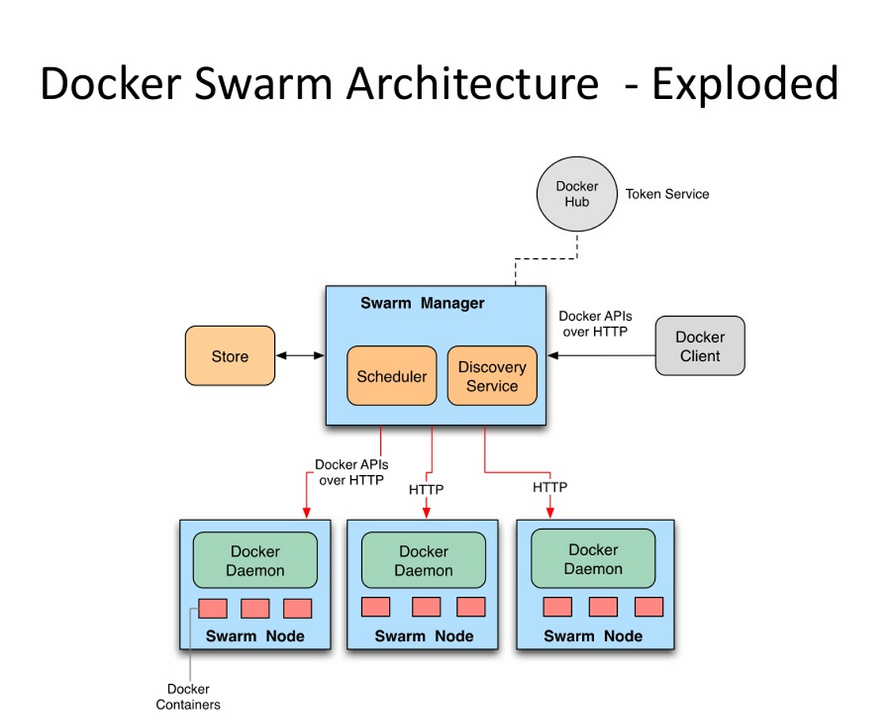

# Docker容器技术学习总结 #

## 7.Docker集群管理##

Docker社区中提供三大编排工具：Compose、Machine和Swarm,其功能如下：

- **Docker Machine：**Docker管理工具。是支持多平台安装Docker的工具，使用Docker Machine可以很方便地在笔记本、云平台及数据中心安装Docker。
- **Docker Swarm：**Docker 集群工具。是Docker社区原生提供的容器集群管理工具。docker集群环境和调度策略等。
- **Docker Compose：**Docker编排工具。是用来组装多容器应用的工具，可以在Swarm集群中部署分布式应用。

### 7.1 Docker Machine ###
[https://docs.docker.com/machine/](https://docs.docker.com/machine/)

#### 7.1.1 Docker Machine概述 ####

Docker Machine是一个简化Docker安装的命令行工具，通过一个简单的命令行即可在相应的平台(笔记本、数据中心主机、云主机等)上安装Docker。简单来说，一个Docker Machine是一个Docker host主机和经过配置的Docker client的结合体。  

从技术上讲，Docker Machine就是一个框架，比较开放。对于任何提供虚拟机服务的平台，只要在这个框架下开发针对该平台的驱动，Docker Machine就可以与其交互，可在该平台上执行创建、删除Machine等操作，并且可控制Machine的行为（停止、启动等）。

#### 7.1.2 Docker Machine基本概念及运行流程 ####

Docker Machine会首先创建一个虚拟机并在其上运行一个Docker host，然后使用Docker client和Docker host通信，从而在Docker host上创建镜像、启动容器。

Docker Machine创建虚拟机的时候需要指定相应的驱动，目前支持在本机运行virtualbox虚拟主机，Hyper-V虚拟主机，VMware虚拟主机，AWS EC2，Azure，DigitalOcean，Google等公有云主机，以及使用Openstack搭建的私有数据中心。新的虚拟化（Xen，KVM）支持以及新的云平台支持可以通过开发驱动的方式支持。

每一个Docker Machine创建的虚拟机都要有一个操作系统，默认情况下，VirtualBox驱动使用boot2docker(运行docker容器的轻量级Linux操作系统)。对于云平台的驱动所创建的虚拟机，默认操作系统数ubuntu12.04+。

Docker Machine创建的Docker host的IP地址是所创建的虚拟机的IP地址。

使用Docker Machine及VirtualBox驱动创建本地虚拟机搭建Docker Host的运行流程如下：  
1） 运行`docker-machine create create --driver virtualbox dev`命令。此命令首先创建用于Docker client和Docker host通信的CA证书。其次创建VirtualBox虚拟机，并配置用于通信的TLS参数及网络配置。最后部署Docker的运行环境，即Docker host。  
2）在Docker client里运行`eval "$(docker-machine env dev)"`命令，配置用于和Docker host通信的环境变量。  
3）使用docker相关命令创建或启动相应的容器，如使用`docker run busybox echo hello world`命令可运行busybox工具集。

#### 7.1.3 Docker Machine实战 ####
**1. Docker Machine本机安装**

	$ docker-machine -v
	$  docker-machine ls
 	#已安装了 VirtualBox，并且要创建一个叫“testing”的虚拟机： 
	$  docker-machine create --driver virtualbox testing
	#docker-machine docker client连接 docker host 
	$  docker-machine env testing
	$  docker-machine config testing
	--tls --tlscacert=/Users/russ/.docker/machine/machines/testing/ca.pem --tlscert=/Users/
	russ/.docker/machine/machines/testing/cert.pem --tlskey=/Users/russ/.docker/machine/machines/
	testing/key.pem -H="tcp://192.168.99.100:2376

	#启用一个虚拟机并准备使用Docker。 
	$  docker-machine ls
	#运行一个“Hello World”： 
	$  docker $(docker-machine config testing) run busybox echo hello world

	#使用docker-machie ssh machine-name命令SSH到虚拟机： 
	$  docker-machine ssh testing

**2. docker-machine启用Digital Ocean的实例**

	docker-machine访问Digital Ocean账户通过API并且启用实例：
	$  docker-machine create --driver digitalocean --digitalocean-access-token <Token> 	dotesting
 
	#以实例dotesting运行“Hello World”:
	$  docker $(docker-machine config dotesting) run busybox echo hello world

### 7.2 Docker Swarm  ###

> Docker 1.12可以原生创建一个 Swarm 集群。

#### 7.2.1 Docker Swarm概述 ####
Swarm 是Docker社区提供的原生支持Docker集群的工具。它可以把多个Docker主机组成的系统转换成为单一的虚拟Docker主机。Swarm对外提供两种API，一种是标准的Docker API，比如Dokku、Docker Compose、Docker Machine、Docker Client等都可以通过Swarm与Docker集群进行通信；另一种是Swarm的集群管理API，用于Docker集群的管理。

Swarm设计的架构遵循“Swap,Plug and Play”的原则。比如，你可以使用喜欢的调度系统来替换Swarm中原生的调度系统。这使得Swarm的扩展变得非常容易。

#### 7.2.2 Docker Swarm内部架构  ####
Swarm的目标是使用同Docker Engine一样的API，将Docker client对API Endpoint的请求，在发往Swarm管理下的Docker引擎节点组成的集群的过程中，可以根据配置好的调度策略、约束规则，分发到集群中的某个引擎节点上去处理。而对客户端来说，这些完全透明。这样实现的主要优势在于既有的工具和API可以像单机版一样继续在Swarm集群上工作和使用。Swarm的功能框架如图7-1所示，Swarm由Discovery Service模块， Scheduler模块和Leadership模块组成。

  
图7-1 Swarm的功能框架

**1、Discovery Service**  
Discovery Service模块用来发现Swarm集群中的节点。该模块采用即插即用的模式，目前支持三种类型的服务发现后端：

- Docker Hub提供的服务发现后端;
- 分布式的K-V存储系统，现已支持Consul、Etcd和Zookeeper;
- 静态描述文件和静态IP地址列列表。

详细Discovery配置参考：[https://docs.docker.com/swarm/discovery/](https://docs.docker.com/swarm/discovery/)

此外，任何服务发现的后端模块只要满足服务发现定义的标准接口定义的功能，Swarm都可以支持。

**2、 Scheduler**  
Swarm的Scheduler模块主要负责给用户新创建的容器分配最优的节点。它通过两个阶段来选择最优的节点：

- 首先根据用户的过滤条件（Filter）筛选出符合要求的节点；
- 然后通过调度策略（Strategy）从筛选节点中选择最优的节点。

**Filters** are divided into two categories, node filters and container configuration filters. Node filters operate on characteristics of the Docker host or on the configuration of the Docker daemon. Container configuration filters operate on characteristics of containers, or on the availability of images on a host。Each filter has a name that identifies it. 

- **node filters：** constraint，health，containerslots
- **container configuration filters:** affinity，dependency，port

详细过滤器（filter）配置参考：[https://docs.docker.com/swarm/scheduler/filter/](https://docs.docker.com/swarm/scheduler/filter/)
 
The **Swarm scheduler** features multiple strategies for ranking nodes. The strategy you choose determines how Swarm computes ranking. When you run a new container, Swarm chooses to place it on the node with the highest computed ranking for your chosen strategy.

To choose a ranking strategy, pass the --strategy flag and a strategy value to the swarm manage command. Swarm currently supports these values:

- spread
- binpack
- random

The spread and binpack strategies compute rank according to a node’s available CPU, its RAM, and the number of containers it has. The random strategy uses no computation. It selects a node at random and is primarily intended for debugging.

**Your goal in choosing a strategy is to best optimize your cluster according to your company’s needs.**

Under the spread strategy, Swarm optimizes for the node with the least number of containers. The binpack strategy causes Swarm to optimize for the node which is most packed. Note that a container occupies resource during its life cycle, including exited state. Users should be aware of this condition to schedule containers. For example, spread strategy only checks number of containers disregarding their states. A node with no active containers but high number of stopped containers may not be selected, defeating the purpose of load sharing. User could either remove stopped containers, or start stopped containers to achieve load spreading. The random strategy, like it sounds, chooses nodes at random regardless of their available CPU or RAM.

Using the spread strategy results in containers spread thinly over many machines. The advantage of this strategy is that if a node goes down you only lose a few containers.

The binpack strategy avoids fragmentation because it leaves room for bigger containers on unused machines. The strategic advantage of binpack is that you use fewer machines as Swarm tries to pack as many containers as it can on a node.

If you do not specify a --strategy Swarm uses spread by default.

详细调度策略（Scheduler）配置参考：[https://docs.docker.com/swarm/scheduler/strategy/](https://docs.docker.com/swarm/scheduler/strategy/)

**Swarm Rescheduling:**  
You can set recheduling policies with Docker Swarm. A rescheduling policy determines what the Swarm scheduler does for containers when the nodes they are running on fail.

You set the reschedule policy when you start a container. You can do this with the reschedule environment variable or the `com.docker.swarm.reschedule-policies` label. If you don’t specify a policy, the default rescheduling policy is off which means that Swarm does not restart a container when a node fails.

**3、LeaderShip**  
Swarm的Leadership模块主要用于大家Swarm HA Cluster的功能。

### 7.3 Docker Compose ###

7.3.1 Compose概述
在实际的生产环境中，一个应用往往由许多组件构成，而Docker的最佳实践是一个容器只运行一个进程，因此需要运行多个组件则必须运行多个容器。Compose是一个用来定义一个或多个容器应用的公教育。使用Compose可以简化容器镜像的建立及容器的运行。Compose使用Python语言开发，非常适合在单机环境里部署一个或多个容器，并自动把多容器互相关联起来。

Compose是使用YML模板文件来定义多容器应用的。Compose使用`docker-compose up`命令将完整的应用运行起来。Compose把YML文件解析成docker命令的参数，然后调用相应的docker命令接口，从而把应用以容器化的方式管理起来。它通过解析容器间的依赖关系顺序地启动容器，而容器间的依赖关系则可以通过在docker-compose.yml文件中使用“links”标记来指定。

对开发环境的搭建、应用服务的部署和CI环境的搭建来说，Compose非常不错。**但是Compose尚处于开发阶段，因而不建议在生产环境中使用。？？**

**Using Compose is basically a three-step process:**

1. Define your app’s environment with a Dockerfile so it can be reproduced anywhere.
2. Define the services that make up your app in docker-compose.yml so they can be run together in an isolated environment.
3. Lastly, run docker-compose up and Compose will start and run your entire app.

#### 7.3.2 Compose配置简介 ####

Compose是对docker命令的封装，默认使用docker-compose.yml文件来指定docker各个命令中所需的参数。

A `docker-compose.yml` looks like this:

	version: '2'
	services:
  		web:
    	build: .
    	ports:
    	- "5000:5000"
    	volumes:
    	- .:/code
    	- logvolume01:/var/log
    	links:
    	- redis
  	redis:
    	image: redis
	volumes:
  		logvolume01: {}

在`docker-compose.yml`文件中，每个另一的服务都至少包含build和image两个命令中的一个，其它的命令都是可选的。`build`命令指定了包含Dockerfile的目录，可以是绝对目录或者相对目录（相对于`docker-compose.yml`所在的位置）。`imgae`命令用于指定提供服务的镜像。

运行`docker-compose build` 和`docker-compose up`命令，上述`docker-compose.yml`中定义的Web和Redis服务都会成功运行起来。

### 7.4 Docker Machine, Compose & Swarm  实战###

参考1：[https://media-glass.es/2015/03/21/docker-machine-compose-swarm/](https://media-glass.es/2015/03/21/docker-machine-compose-swarm/)   
参考2：Docker在OpenStack上的集群实战《Docker进阶与实战》P190