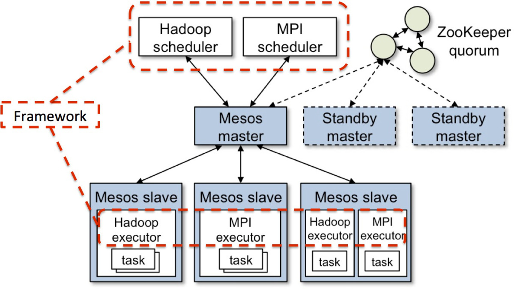
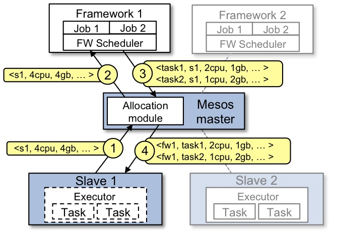
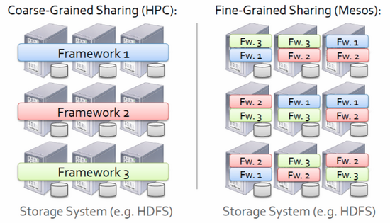
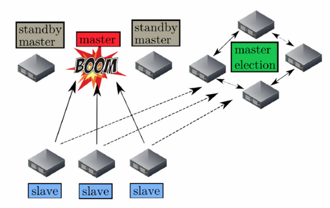

# Docker容器技术学习总结 #

## 10.Mesos##

### 10.1 Mesos是什么？ ###

Mesos是Apache下的开源分布式资源管理框架，它被称为是分布式系统的内核。Mesos最初是由加州大学伯克利分校的AMPLab开发的，后在Twitter得到广泛使用。

软件定义数据中心(SDDC)底层基础架构应该可以从运行于其上的应用程序中抽象出来，并根据应用程序不断变化的需求，动态且自动地分配、重新分配应用程序，然后运行于数据中心的不同组件之中。

可否整合数据中心中的所有资源，并将它们放在一个大的虚拟池里，代替单独的物理服务器；然后开放诸如CPU、内存和I/O这些基本资源而不是虚拟机？同样，可否把应用程序拆分成小的、隔离的任务单位，从而根据数据中心应用的需求，从虚拟数据中心池中动态分配任务资源？就像操作系统将PC的处理器和RAM放入资源池，使其可以为不同的进程协调分配和释放资源。进一步讲，我们可以把Mesos作为操作系统内核，然后将数据中心看为PC。这也是正是我想说的：Mesos正在改变数据中心，它让真正的SDDC成为现实。

图10-1 两级调度架构

如图10-1所示，Mesos实现了两级调度架构，它可以管理多种类型的应用程序。

- 第一级调度是Master的守护进程，管理Mesos集群中所有节点上运行的Slave守护进程。集群由物理服务器或虚拟服务器组成，用于运行应用程序的任务，比如Hadoop和MPI作业。
- 第二级调度由被称作Framework的“组件”组成。Framework包括调度器（Scheduler）和执行器（Executor）进程，其中每个节点上都会运行 执行器。Mesos能和不同类型的Framework通信，每种Framework由相应的应用集群管理。上图中只展示了Hadoop和MPI两种类型， 其它类型的应用程序也有相应的Framework。

Mesos Master协调全部的Slave，并确定每个节点的可用资源，聚合计算跨节点的所有可用资源的报告，然后向注册到Master的Framework（作为Master的客户端）发出资源邀约。Framework可以 根据应用程序的需求，选择接受或拒绝来自master的资源邀约。一旦接受邀约，Master即协调Framework和Slave，调度参与节点上任 务，并在容器中执行，以使多种类型的任务，比如Hadoop和Cassandra，可以在同一个节点上同时运行。

### 10.2 Mesos体系结构和工作流 ###

#### 10.2.1 Mesos工作流 ####

Slave是运行在物理或虚拟服务器上的Mesos守护进程，是Mesos集群的一部分。Framework由调度器（Scheduler）应用程序和任务执行器（Executor）组成，被注册到Mesos以使用Mesos集群中的资源。
    
图10-2 Mesos工作流

- Slave 1向Master汇报其空闲资源：4个CPU、4GB内存。然后，Master触发分配策略模块，得到的反馈是Framework 1要请求全部可用资源。
- Master向Framework 1发送资源邀约，描述了Slave 1上的可用资源。
- Framework的调度器（Scheduler）响应Master，需要在Slave上运行两个任务，第一个任务分配<2 CPUs, 1 GB RAM>资源，第二个任务分配<1 CPUs, 2 GB RAM>资源。
- 最后，Master向Slave下发任务，分配适当的资源给Framework的任务执行器（Executor）,接下来由执行器启动这两个任务（如图中虚线框所示）。 此时，还有1个CPU和1GB的RAM尚未分配，因此分配模块可以将这些资源供给Framework 2。

#### 10.2.2 Mesos资源分配 ####
为了实现在同一组Slave节点集合上运行多任务这一目标，Mesos使用了隔离模块， 该模块使用了一些应用和进程隔离机制来运行这些任务。虽然可以使用虚拟机隔离实现隔离模块，但是Mesos当前模块支持的是容器隔离。Mesos早在2009年就用上了Linux的容器技术，如cgroups和Solaris Zone，时至今日这些仍然是默认的。 然而，Mesos社区增加了Docker作为运行任务的隔离机制。 不管使用哪种隔离模块，为运行特定应用程序的任务，都需要将执行器全部打包，并在已经为该任务分配资源的Slave服务器上启动。 当任务执行完毕后，容器会被“销毁”，资源会被释放，以便可以执行其他任务。  

**资源邀约**即由Master向注册其上的Framework发送资源邀约。每次资源邀约包含一份Slave节点上可用的CPU、RAM等资源的列表。Master提供这些资源给它的Framework，是基于分配策略的。分配策略对所有的Framework普遍适用，同时适用于特定的Framework。 Framework可以拒绝资源邀约，如果它不满足要求，若此，资源邀约随即可以发给其他Framework。 由Mesos管理的应用程序通常运行短周期的任务，因此这样可以快速释放资源，缓解Framework的资源饥饿； Slave定期向Master报告其可用资源，以便Master能够不断产生新的资源邀约。 另外，还可以使用诸如此类的技术， 每个Fraamework过滤不满足要求的资源邀约、Master主动废除给定周期内一直没有被接受的邀约。

**分配策略**有助于Mesos Master判断是否应该把当前可用资源提供给特定的Framework，以及应该提供多少资源。 关于Mesos中使用资源分配以及可插拔的分配模块，实现非常细粒度的资源共享，会单独写一篇文章。 言归正传，Mesos实现了公平共享和严格优先级（这两个概念我会在资源分配那篇讲）分配模块， 确保大部分用例的最佳资源共享。已经实现的新分配模块可以处理大部分之外的用例。

### 10.3 Mesos持久化存储和容错 ###

#### 10.3.1 Mesos持久化存储 ####
Mesos是如何处理持久化存储的呢？如果我在运行一个数据库作业，Mesos如何确保当任务被调度时，分配的节点可以访问其所需的数据？

  
图10-3 Mesos HDFS存储

其实Mesos可以有多种选择来处理持久化存储的问题：

- **分布式文件系统。**如上所述，Mesos可以使用DFS（比如HDFS或者Lustre）来保证数据可以被Mesos集群中的每个节点访问。这种方式的缺点是会有网络延迟，对于某些应用程序来说，这样的网络文件系统或许并不适合。
- **使用数据存储复制的本地文件系统。**另一种方法是利用应用程序级别的复制来确保数据可被多个节点访问。提供数据存储复制的应用程序可以是NoSQL数据库，比如Cassandra和MongoDB。这种方式的优点是不再需要考虑网络延迟问题。缺点是必须配置Mesos，使特定的任务只运行在持有复制数据的节点上，因为你不会希望数据中心的所有节点都复制相同的数据。为此，可以使用一个Framework，静态地为其预留特定的节点作为复制数据的存储。
- **不使用复制的本地文件系统**。也可以将持久化数据存储在指定节点的文件系统上，并且将该节点预留给指定的应用程序。和前面的选择一样，可以静态地为指定应用程序预留节点，但此时只能预留给单个节点而不是节点集合。
> 后面两种显然不是理想的选择，因为实质上都需要创建静态分区。然而，在不允许延时或者应用程序不能复制它的数据存储等特殊情况下，我们需要这样的选择。

Mesos项目还在发展中，它会定期增加新功能。现在我已经发现了两个可以帮助解决持久化存储问题的新特性：

- **动态预留。**Framework可以使用这个功能框架保留指定的资源，比如持久化存储，以便在需要启动另一个任务时，资源邀约只会发送给那个Framework。这可以在单节点和节点集合中结合使用Framework配置，访问永久化数据存储。关于这个建议的功能的更多信息可以从 此处 获得。
- **持久化卷。**该功能可以创建一个卷，作为Slave节点上任务的一部分被启动，即使在任务完成后其持久化依然存在。Mesos为需要访问相同的数据后续任务，提供在可以访问该持久化卷的节点集合上相同的Framework来初始化。

#### 10.3.2 Mesos容错 ####
Mesos的优势之一便是将容错设计到架构之中，并以可扩展的分布式系统的方式来实现。Mesos在其协议栈上是如何提供容错能力的？

**1. Master**

  
图10-4 Mesos Master容错机制  

图图10-4所示，故障处理机制和特定的架构设计实现了Master的容错:

 - 首先，Mesos决定使用热备份（hot-standby）设计来实现Master节点集合。
 > >一个Master节点与多个备用（standby）节点运行在同一集群中，并由开源软件Zookeeper来监控。Zookeeper会监控Master集群中所有的节点，并在Master节点发生故障时管理新Master的选举。建议的节点总数是5个，实际上，生产环境至少需要3个Master节点。 Mesos决定将Master设计为持有软件状态，这意味着当Master节点发生故障时，其状态可以很快地在新选举的Master节点上重建。 
 
 - 其次，Framework和选举后的Slave节点集合在新的Master上注册。
 > >Mesos的状态信息实际上驻留在Framework调度器和Slave节点集合之中。当一个新的Master当选后，Zookeeper会通知Framework和选举后的Slave节点集合，以便使其在新的Master上注册。彼时，新的 Master可以根据Framework和Slave节点集合发送过来的信息，重建内部状态。

**2. Framework调度器**

Framework调度器的容错是通过Framework将调度器注册2份或者更多份到Master来实现。当一个调度器发生故障时，Master会通知另一个调度来接管。需要注意的是Framework自身负责实现调度器之间共享状态的机制。

**3. Slave**

- **Slave进程失败：** Mesos实现了Slave的恢复功能，当Slave节点上的进程失败时，可以让执行器/任务继续运行，并为那个Slave进程重新连接那台Slave节点上运行的执行器/任务。当任务执行时，Slave会将任务的监测点元数据存入本地磁盘。如果Slave进程失败，任务会继续运行，当Master重新启动Slave进程后，因为此时没有可以响应的消息，所以重新启动的Slave进程会使用检查点数据来恢复状态，并重新与执行器/任务连接。
- **Slave节点失败：**当计算节点/Slave节点无法响应多个连续的消息后，Master会从可用资源的列表中删除该节点，并会尝试关闭该节点。然后，Master会向分配任务的Framework调度器汇报执行器/任务失败，并允许调度器根据其配置策略做任务失败处理。通常情况下，Framework会重新启动任务到新的Slave节点，假设它接收并接受来自Master的相应的资源邀约。

**4. 执行器/任务**   

与计算节点/Slave节点故障类似，Master会向分配任务的Framework调度器汇报执行器/任务失败，并允许调度器根据其配置策略在任务失败时做出相应的处理。通常情况下，Framework在接收并接受来自Master的相应的资源邀约后，会在新的Slave节点上重新启动任务。

### 10.4 Mesos资源分配 ###

Mesos Master代理任务的调度首先从Slave节点收集有关可用资源的信息，然后以资源邀约的形式，将这些资源提供给注册其上的Framework。Framework可以根据是否符合任务对资源的约束，选择接受或拒绝资源邀约。一旦资源邀约被接受，Framework将与Master协作调度任务，并在数据中心的相应Slave节点上运行任务。如何作出资源邀约的决定是由资源分配模块实现的，该模块存在于Master之中。资源分配模块确定Framework接受资源邀约的顺序，与此同时，确保在本性贪婪的Framework之间公平地共享资源。  
Mesos是专门管理异构环境中的资源，所以它实现了一个可插拔的资源分配模块架构，将特定部署最适合的分配策略和算法交给用户去实现。例如，用户可以实现加权的最大最小公平性算法，让指定的Framework相对于其它的Framework获得更多的资源。默认情况下，Mesos包括一个严格优先级的资源分配模块和一个改良的公平份额资源分配模块。严格优先级模块实现的算法给定Framework的优先级，使其总是接收并接受足以满足其任务要求的资源邀约。这保证了关键应用在Mesos中限制动态资源份额上的开销，但是会潜在其他Framework饥饿的情况。由于这些原因，大多数用户默认使用**DRF**（主导资源公平算法 **Dominant Resource Fairness**），这是Mesos中更适合异质环境的改良公平份额算法。

**DRF**的目标是确保每一个用户，即Mesos中的Framework，在异质环境中能够接收到其最需资源的公平份额。为了掌握DRF，我们需要了解**主导资源（dominant resource）**和**主导份额（dominant share）**的概念。Framework的主导资源是其最需的资源类型（CPU、内存等），在资源邀约中以可用资源百分比的形式展示。例如，对于计算密集型的任务，它的Framework的主导资源是CPU，而依赖于在内存中计算的任务，它的Framework的主导资源是内存。因为资源是分配给Framework的，所以DRF会跟踪每个Framework拥有的资源类型的份额百分比；Framework拥有的全部资源类型份额中占最高百分比的就是Framework的主导份额。DRF算法会使用所有已注册的Framework来计算主导份额，以确保每个Framework能接收到其主导资源的公平份额。  

一般情况下，现在大多数的任务是短暂的，Mesos能够等待任务完成并重新分配资源。然而，集群上也可以跑长时间运行的任务，这些任务用于处理挂起作业或行为不当的Framework。值得注意的是，在当资源释放的速度不够快的情况下，资源分配模块具有撤销任务的能力。Mesos尝试如此撤销任务：向执行器发送请求结束指定的任务，并给出一个宽限期让执行器清理该任务。如果执行器不响应请求，分配模块就结束该执行器及其上的所有任务。分配策略可以实现为，通过提供与Framework相关的保证配置，来阻止对指定任务的撤销。如果Framework低于保证配置，Mesos将不能结束该Framework的任务。
